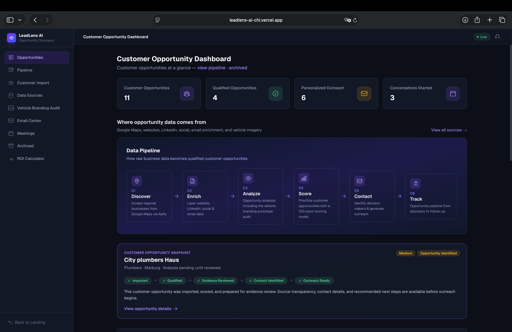
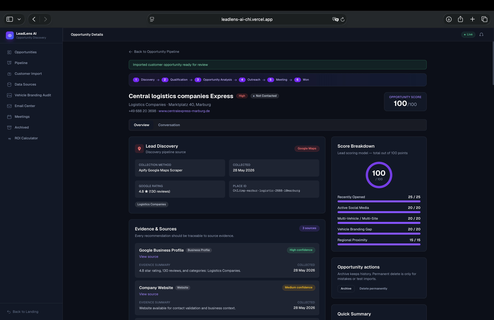
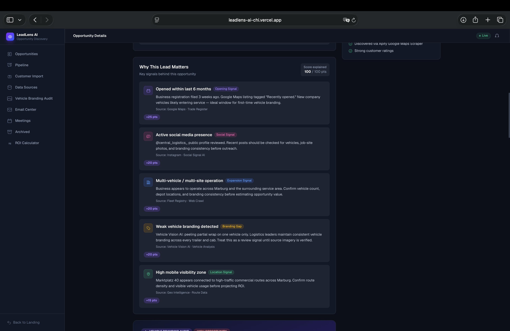
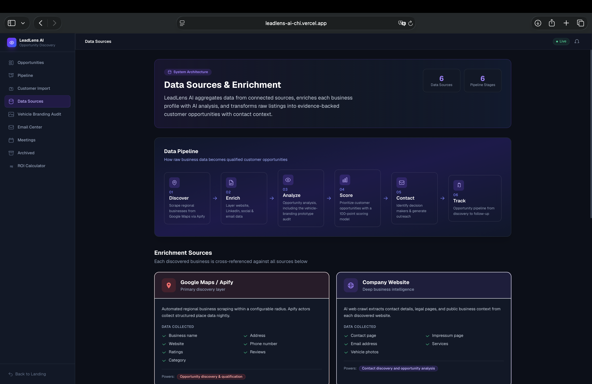
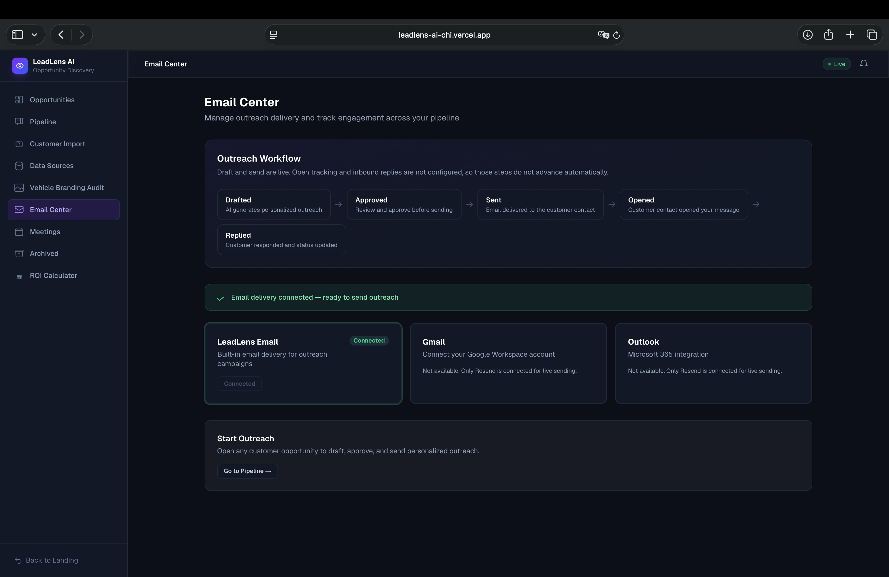

# LeadLens AI 🚀

**AI-powered lead intelligence and sales workflow platform for discovering, qualifying, prioritizing and managing business opportunities.**

> LeadLens AI is actively developed in a private production repository. This public repository provides the product showcase, architecture overview, screenshots, and live demonstration.

## Live Demo

[Open the LeadLens AI live demo](https://leadlens-ai-chi.vercel.app)

## Overview

LeadLens AI helps teams identify and manage business opportunities through a connected workflow that combines lead discovery, opportunity intelligence, evidence-based analysis, prioritization, personalized outreach and CRM tracking.

The current prototype uses vehicle-branding opportunities as a specialized first use case, while the broader product vision extends to wider B2B lead-intelligence and sales workflows.

## Key Features

- Lead discovery and customer opportunity import
- Opportunity intelligence and evidence review
- Lead scoring and prioritization
- Contact discovery
- Personalized outreach workflows
- CRM pipeline and status tracking
- Customer response links
- Meeting workflow
- Archive, restore and do-not-contact controls
- Current specialized prototype: vehicle-branding opportunity analysis

## Product Screenshots

### Opportunity Dashboard

Central workspace for reviewing, filtering and prioritizing customer opportunities.

### Opportunity Intelligence & Evidence

Detailed opportunity analysis with supporting evidence and structured lead intelligence.

### Why This Opportunity Matters

Business signals and contextual insights used to understand and evaluate an opportunity.

### Opportunity Pipeline

CRM-style workflow for managing opportunities through different stages of the sales process.

### Personalized Outreach Workflow

Workspace for preparing and managing personalized communication with potential customers.

## Tech Stack

- Next.js
- TypeScript
- PostgreSQL
- Prisma
- AI-assisted workflows
- Resend
- Vercel

## Project Background

LeadLens AI originated during the **STARTMIUP Hackathon — AI for Mittelhessen** and has continued to evolve beyond the original hackathon prototype.

The project is being developed toward a broader lead-intelligence and sales-workflow product, with continued work around product design, data persistence, outreach workflows, customer responses and real-world usability.

## Current Status

**Active prototype — under continued development.**

The live demo represents the current product direction. Some integrations and advanced automation features are still being developed.

## Source Code

The production source repository is private.

This repository serves as the public portfolio and product showcase for LeadLens AI.